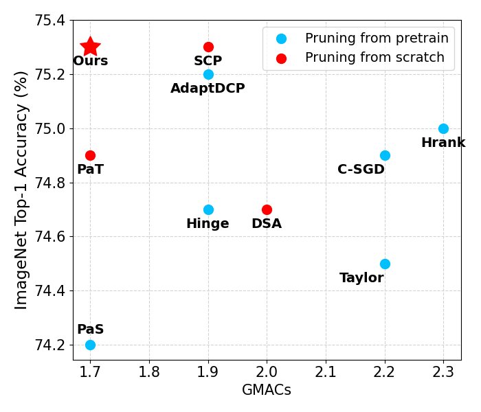

# Pruning from Scratch via Shared Pruning Module and Nuclear norm-based Regularization

Official implementation of [Pruning from Scratch via Shared Pruning Module and Nuclear norm-based Regularization](https://openaccess.thecvf.com/content/WACV2024/html/Lee_Pruning_From_Scratch_via_Shared_Pruning_Module_and_Nuclear_Norm-Based_WACV_2024_paper.html) (WACV 2024).

## Abstract

Most pruning methods focus on determining redundant channels from the pre-trained model.
However, they overlook the cost of training large networks and the significance of selecting channels for effective reconfiguration.
In this paper, we present a "pruning from scratch" framework that considers reconfiguration and expression capacity.
Our Shared Pruning Module (SPM) handles a channel alignment problem in residual blocks for lossless reconfiguration after pruning.
Moreover, we introduce nuclear norm-based regularization to preserve the representability of large networks during the pruning process.
By combining it with MACs-based regularization, we achieve an efficient and powerful pruned network while compressing towards target MACs.
The experimental results demonstrate that our method prunes redundant channels effectively to enhance representation capacity of the network.
Our approach compresses ResNet50 on ImageNet without requiring additional resources, achieving a top-1 accuracy of 75.3% with only 41% of the original model's MACs.

**Comparison of Top-1 Accuracy according to MACs for compressed ResNet50 models on ImageNet**
<div align="center">
  
</div>


**Overall method**
<div align="center">
  
</div>

## Training & Reconfiguration
```python
cd ./CLS
```

### Prepare ImageNet dataset
1. Download dataset
2. Extract the training and validation dataset
```shell
sh ./scripts/extract_ILSVRC.sh
```

### Training
```python
sh ./scripts/train.sh
```

### Weight
[Download weight](https://drive.google.com/file/d/1pjw5uxTb9OrlGFkDxvmCii8Sr33CP26J/view?usp=sharing)

* Accuracy        : 75.3%
* MACs            : 1.7G
* $\alpha_{mac}$  : 0.5
* $\alpha_{nuc}$  : 0.001

### Reconfiguration
Reconfiguration is required for real network acceleration of structured pruning.
```python
python reconfigure.py -b 256 -p 50 --state_dict <state_dict path>
```
## Reference
This repository is built using [DeepLearningExamples](https://github.com/NVIDIA/DeepLearningExamples).